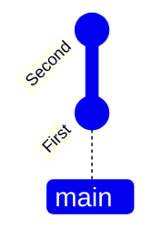
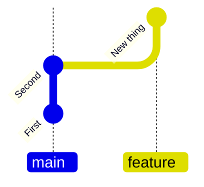
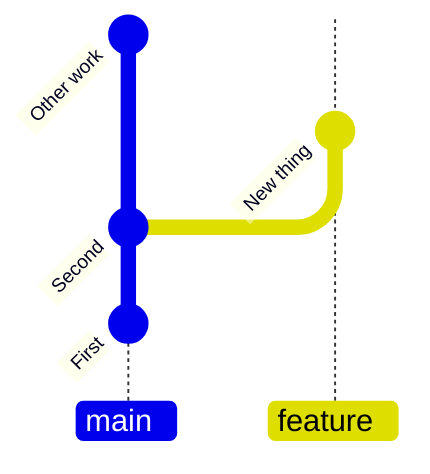
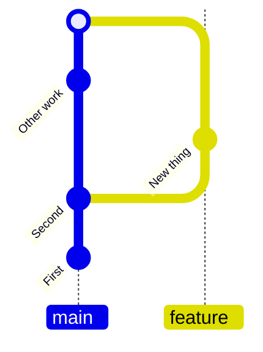
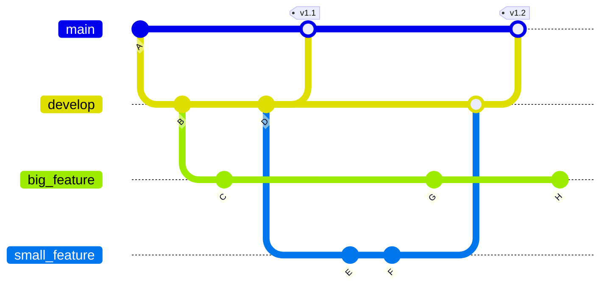

# Version Control as Coordination

## Git is how you coordinate with AI

::left::

- AI works on branches; you review on `main`
- Commits are atomic units of AI-generated change
- History lets you **revert** bad AI output
- PRs are the human–AI code review gateway

<v-click>

**This is not new.** Version control was built for collaboration between humans. Branches, commits, and PRs let teams work together without stepping on each other. AI agents are now collaborators too, and the same workflow applies.

</v-click>

<v-click>

AI can write Git commands — but **you** decide what to commit and merge.

</v-click>

::right::

::center

::

---

# Code management & collaboration

::centralise::

::center

<i>"If you're not using version control, 
whatever else you might be doing with a computer, 
it's not science."</i> 
 
Greg Wilson, SWC 
<i>First Executive Director of Software Carpentry</i>

::

---

# Version Control

- These skills will save you time
- Always assume others will use and develop your software — **including AI agents**
- Be clear on requirements and assume they will change
- Funders are increasingly expecting software outputs to be sustainable and reusable

---

# Version Control

Three pillars — all still essential with AI:

- **Backup** — AI can lose context; Git preserves everything
- **Reproducibility** — pin exact code for each result
- **Collaboration** — coordinate human + AI contributions

---

# How do version control tools work?

- Start by storing the base version of the file
- After that, only changes are stored
- Like instructions for building lego

::centralise::

::center

::

---
layout: two-cols-header
---

# Staging and commits

::centralise::

::left::

  

    

    
Working directory

    

    

      
Staging area

    

    

      
Repository

    

  

  <FancyArrow
    x1="-14"
    y1="30"
    x2="-75"
    y2="65"
    arc="-0.4"
    head-size="15"
  />
  
  

    <code>git add</code>
  

  
  <FancyArrow
    x1="-75"
    y1="95"
    x2="-14"
    y2="130"
    arc="-0.4"
    head-size="15"
  />
  
  <FancyArrow
    x1="188"
    y1="130"
    x2="250"
    y2="165"
    arc="0.4"
    head-size="15"
  />

  

    <code>git commit</code>
  

  
  <FancyArrow
    x1="250"
    y1="195"
    x2="188"
    y2="230"
    arc="0.4"
    head-size="15"
  />
  

::right::

- **Staging**: Select files to include in the next Commit (`git add`)
- **Commit**: Save the staged files to the repository (`git commit`) with a message describing the changes
- AI can generate both commands, but **verify what AI staged** — did it include generated files?

---

# Git Branches + Feature Branch Workflow

Commit to main branch

Create a new branch, make commits to it

Changes independent of main branch

Merge commit

 

- Main branch for tested, stable code; feature branches for AI experiments
- **AI should always work on a branch** — easy to discard bad output

---

# Git Branches

::centralise::

::center

::

---

# AI and Version Control

<v-clicks>

- AI can **write Git commands** — but you need to understand the concepts
- AI can **generate commit messages** — evaluate quality, don't accept blindly
- AI can **resolve merge conflicts** — but may not understand semantics
- **Branch strategy**: AI experiments go on feature branches
- **Review AI's Git history**: did it commit the right files? Good messages?

</v-clicks>

---
layout: instruction
---

# Version Control + AI

::left::

::center
AI-generated commit messages
::

::right::
::small

- Make a change to a file
- Ask AI to generate a commit message: `git commit -m "<AI message>"`
- Evaluate: is it accurate? descriptive? helpful?
- Now ask AI to generate a **misleading** commit message
- Lesson: **AI can help or deceive** — you must review

::

---
layout: instruction
---

# Version Control + AI

::left::

::center
Branches and merging
::

::right::
::small

- Create a feature branch: `git switch -c ai-experiment`
- Ask AI to make changes and commit them
- Switch to main, make a conflicting change
- Ask AI to merge and resolve the conflict
- Switch branches and take a look at the differences: `git switch main`
- Merge your feature branch into main: `git merge ai-experiment`
- Review what AI did

::
