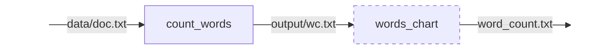
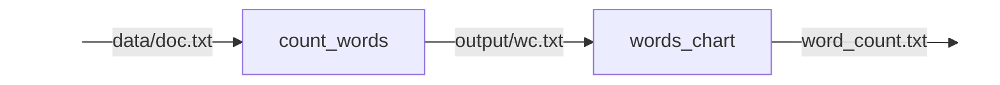
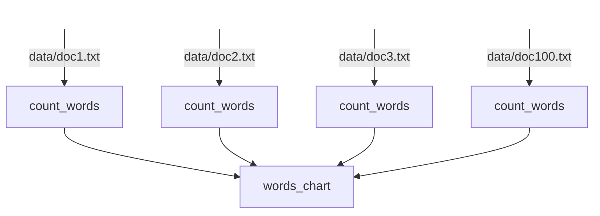

# Workflow Managers

- Manage larger pipelines
- Maintains the **Recording Computational Steps** philosophy
- Workflow managers encapsulate complex pipelines
- Can speed up analyses by preventing redundant computation

---

# Snakemake

<span />

A tool to create **reproducible** and **scalable** data analyses.

Workflows are described via a human **readable, Python based language**.

They can be **seamlessly scaled** to server, cluster, grid and cloud environments, without the need to modify the workflow definition.

Workflows can entail a **description of required software**, which will be automatically deployed to any execution environment.

<div class="h-8" />

::center

::

---
layout: instruction
---

# Snakemake

::left::

::center
Install Snakemake
::

::right::

Navigate to the course workflows repository:
[github.com/OxfordRSE/softeng-daycourse-workflows](https://github.com/OxfordRSE/softeng-daycourse-workflows)
and start a new codespace.


Installed `snakemake` with `pip`:
```bash
pip install snakemake
```

Verify that `snakemake` is installed by typing:
```bash
snakemake --version
```

---
layout: instruction
---

# A simple workflow

::left::

::center
Run a workflow by hand...

<br />

<div class="text-sm">
Before you start, generate a file with random words:

```bash
python generate.py
```

Let's create a frequency plot of the words in that file.
</div>
::

::right::

<p>
Use another script to count the frequency of words in the file and output the results:
<span v-mark.underline.orange="1">

```bash
python count_words.py -in data/doc.txt -out output/wc.txt
```

</span>
</p>

Form a bar chart of the word frequencies, and save it to `word_chart.txt`:
```bash
python words_chart.py
```

Finally, you can view the results by opening `word_chart.txt`.

---
transition: "none"
---

# Snakemake

<span />

Command:
```bash
python count_words.py -in data/doc.txt -out output/wc.txt
```

<br />

<v-click>
Translated to Snakemake:

```python
rule count_words:
    input:
        "data/doc.txt"
    output:
        "output/wc.txt"
    shell:
        """
        python count_words.py -in {input} -out {output}
        """
```

</v-click>

<div class="h-7" />

<v-click>

::center



::

</v-click>

---

# Snakemake

<span />

Command:
```bash
python words_chart.py
```

<br />

<v-click>
Translated to Snakemake:

```python
rule words_chart:
    input:
        "output/wc.txt"
    output:
        "words_chart.txt"
    script:
        "words_chart.py"
```

</v-click>

<div class="h-7" />

<v-click>

::center



::

</v-click>

---
layout: two-cols-header
class: "gap-4"
---

# Snakemake

::left::

```python
rule all:
    input:
        "words_chart.txt"

rule count_words:
    input:
        "data/doc.txt"
    output:
        "output/wc.txt"
    shell:
        """
        python count_words.py -in {input} -out {output}
        """

rule words_chart:
    input:
        "output/wc.txt"
    output:
        "words_chart.txt"
    script:
        "words_chart.py"
```

::right::

<v-click>

```bash
snakemake --snakefile onefile.smk --cores 1
```

Open `words_chart.txt` to see the results.

</v-click>

---

# Snakemake

<span />

What if we have more than one file?

```bash
python generate.py -n 100 -w 1000
```

<div class="h-8" />

::center

::

---
layout: two-cols-header
class: "gap-4"
transition: "none"
---

# Adapt to multiple files

::left::

```python {all|7,9,17}
rule all:
    input:
        "words_chart.txt"

rule count_words:
    input:
        "data/doc.txt"
    output:
        "output/wc.txt"
    shell:
        """
        python count_words.py -in {input} -out {output}
        """

rule words_chart:
    input:
        "output/wc.txt"
    output:
        "words_chart.txt"
    script:
        "words_chart.py"
```

---
layout: two-cols-header
class: "gap-4"
transition: "none"
---

# Adapt to multiple files

::left::

```python {7,9,17}
rule all:
    input:
        "words_chart.txt"

rule count_words:
    input:
        "data/doc.txt"
    output:
        "output/wc.txt"
    shell:
        """
        python count_words.py -in {input} -out {output}
        """

rule words_chart:
    input:
        "output/wc.txt"
    output:
        "words_chart.txt"
    script:
        "words_chart.py"
```

::right::

```python {7,9,17}
rule all:
    input:
        "words_chart.txt"

rule count_words:
    input:
        "data/doc{n}.txt"
    output:
        "output/wc{n}.txt"
    shell:
        """
        python count_words.py -in {input} -out {output}
        """

rule words_chart:
    input:
        [f"output/wc{n}.txt" for n in range(1, 101)]
    output:
        "words_chart.txt"
    script:
        "words_chart.py"
```

---
layout: two-cols-header
class: "gap-4"
---

# Adapt to multiple files

::left::

```bash
snakemake --snakefile multiplefiles.smk --cores all
```

<div class="h-10" />

::center
<v-click>

</v-click>
::

::right::

```python
rule all:
    input:
        "words_chart.txt"

rule count_words:
    input:
        "data/doc{n}.txt"
    output:
        "output/wc{n}.txt"
    shell:
        """
        python count_words.py -in {input} -out {output}
        """

rule words_chart:
    input:
        [f"output/wc{n}.txt" for n in range(1, 101)]
    output:
        "words_chart.txt"
    script:
        "words_chart.py"
```

---

# Snakemake

- Selective rebuilds
  - Only runs rules when their inputs (or scripts) are **newer than their outputs**
  - If nothing is out of date, snakemake does nothing

- Parallelisation
  ```
  snakemake --cores 8
  ```

<div class="h-8" />

::center

::

---
layout: two-cols-header
class: "gap-4"
rightClass: "items-center justify-center"
---

# Snakemake

::left::

More benefits:
- Implementation agnostic
- Run each rule in its own virtual environment (e.g. `conda` directive)
- Modularise workflow (and reuse) (`module` directive)
- Support for `temporary` and `protected` files

Scheduling heuristic is applied to:
- Maximise parallelization
- Prefer high priority jobs
- Subject to resource constraints

::right::


